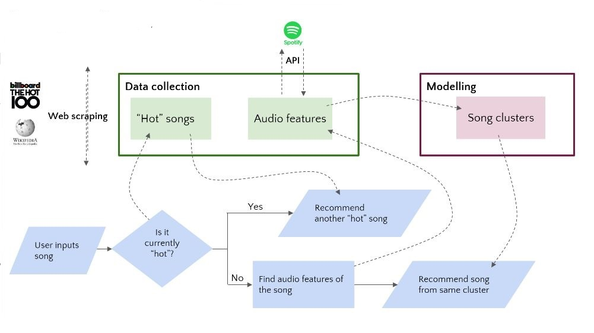

# Music Recommendation System

Building a Song Recommender based on Audio Features

  

# Case Study Description: The site for recommendations - "Gnod"

1- Web scraping using beautifulsoup to get Billboard Hot 100

2- Spotify API to get Soptify dataset

3- Clustring using Kmeans (5 Clusters)

4- Flexible search (Song/Artist)

5- You will get your results in case of mistyping with 40% error  

## Scenario

  

You have been hired as a Data Analyst for "Goldfinch".

"Gnod" is a site that provides recommendations for music, art, literature and products based on collaborative filtering algorithms. Their flagship product is the music recommender, which you can try at www.gnoosic.com. The site asks users to input 3 bands they like, and computes similarity scores with the rest of the users. Then, they recommend to the user bands that users with similar tastes have picked.

"Goldfinch" is a small company, and its only revenue stream so far are adds in the site. In the future, they would like to explore partnership options with music apps (such as Deezer, Soundcloud or even Apple Music and Spotify). However, for that to be possible, they need to expand and improve their recommendations.

That's precisely where you come. They have hired you as a Data Analyst, and they expect you to bring a mix of technical expertise and business mindset to the table.

Jane, CTO of Gnod, has sent you an email assigning you with your first task.

##  1. Exploring & Preparing the Data

- Web Scraping Hot100 Notebook: `notebooks/hot100.ipynb`
- Spotify API Notebook:  `notebooks/spotify.ipynb`
- Modelling Notebook: `notebooks/Kmeans_Model.ipynb`
- Main Function Notebook: `notebooks/goldfinch.ipynb`

